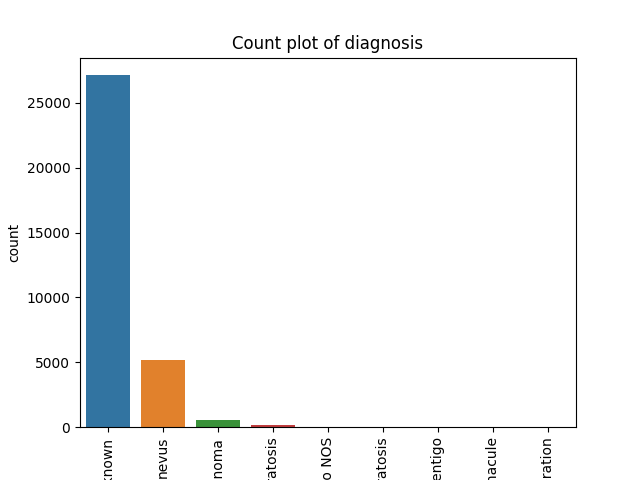
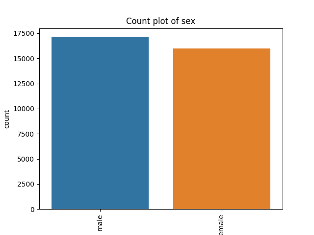
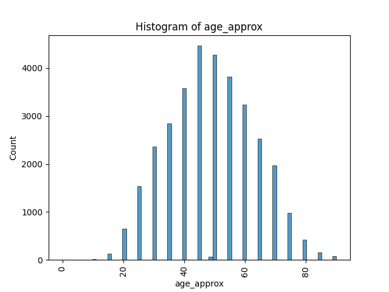
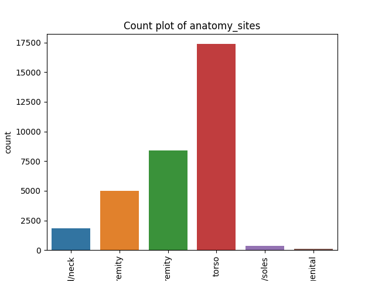
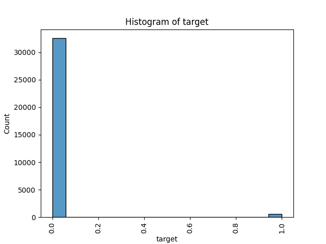

>   **Abstract:**

>   As we approach the submission of the capstone project, which reflects my culmination of learning and understanding in ML, I have realized that there is still much more to learn to effectively apply it in a real-world context.

>   For instance, I am developing the initial Pay-Per-Use dermatology Electronic Medical Record (EMR) solution tailored to the Indian market. A valuable feature that would greatly benefit doctors is a patient complaint triage system. However, our platform, symabMED.in, is not yet prepared for implementation. Our system must run continuously for 12 to 18 months to gather relevant metadata and high-resolution images with accurate categorization for a real-world scenario in India. This data collection phase is crucial to ensure the effectiveness and reliability of our solution.

>   In the meantime, developing a generic framework using the HAM10000 dataset in the interim would be beneficial. This dataset can be a valuable resource for training and initial system testing. Furthermore, by building and fine-tuning the framework with this dataset, you can assess its performance, make necessary improvements, and gain valuable insights before incorporating the actual data from the Indian market.

>   Skin cancers encompass a range of diseases marked by the presence of abnormal growths or persistent sores that do not heal, as well as alterations in the size, shape, or colour of moles. There are two primary types: melanoma (less prevalent but more hazardous) and non-melanoma skin cancers (more common but less severe).

>   Notably, India experiences a relatively lower incidence of skin cancer than Western countries. This can be attributed, in part, to individuals with darker skin being less susceptible to this condition. The higher levels of melanin in darker skin provide a certain degree of protection against damage caused by UV radiation, thereby reducing the risk of developing skin cancer

>   However, regional variations can play a role in the prevalence of skin cancer in India: our system, in addition to other standard data like age, gender and what is included in the HAM dataset, a new training data may include the following features.

>   Latitude: Regions closer to the equator receive more intense sunlight, increasing the risk of skin cancer. Hence, regions in the southern part of India may see a slightly higher incidence rate.

>   Altitude: Higher altitudes receive more UV radiation. Therefore, areas at higher elevations could potentially have a higher incidence of skin cancer.

>   Outdoor occupations: In regions where more people work outdoors (like farming communities), there are increased sun exposure and a potentially higher risk of skin cancer.

>   Urban vs rural: Urban areas might see different rates due to lifestyle differences, including more indoor work and potentially more access to healthcare for early detection.

>   Cultural and social practices: Clothing, sunscreens, and shade can vary by region and influence skin cancer rates. Some traditional attire covers much of the body, providing natural sun protection

>   I intend to build a generic framework as part of my capstone project. This framework consists of the following routines by taking in DataFrame.

-   Pre and post-reports to provide details of the dataset
-   feature cleaning and normalization (such as one-hot encoding and replacing null values)
-   standardize the image files and remove corrupt images
-   identify a suitable machine-learning model for categorization prediction.

>   By developing and implementing these routines, I aim to enhance the quality and consistency of the metadata within the dataset, ensuring that it is well-organized and suitable for further analysis, ensuring that the dataset remains reliable and accurate for subsequent image-based analysis and processing.

>   I intend to test this routine using the HAM10000 dataset from the year 2020.

>   If all components of the project work as intended, you will have a comprehensive codebase capable of handling any DataFrame for image classification. Furthermore, the framework will facilitate data visualization and preparation for ML modelling, including selecting appropriate models. Additionally, I aim to provide an API that can be utilized as a real-world service.

>   **Problem Statement**:

>   "Develop a machine learning model to assist dermatologists in India with triaging skin conditions. The model should classify different skin conditions based on images, aiding in quicker and more efficient preliminary diagnosis. The target is to improve the efficiency of dermatologists by reducing their workload, enabling them to focus on more complex and urgent cases. The model is not intended to replace human diagnosis but to supplement it, serving as a first-line screening tool."

-   Step 1: define a variable for the row CSV file
-   Step 2: write a code for pre-processing the dataset
    -   Create DataFrame
    -   Sumerzies the datset inormation
    -   Visualize the data set
    -   Report the issues
-   Step 3: write a code for processing the dataset
    -   feature cleaning and normalization (such as one-hot encoding and replacing null values)
    -   standardize the image files and remove corrupt images
    -   Balance the data in the dataset
    -   Write a new CSV file and images files
-   Step 4: write a code for Post-processing the dataset
    -   Create DataFrame from the new CSV file
    -   Sumerzies the datset inormation
    -   Visualize the data set
    -   Create Train and Test data set
-   Step 5: write a code to identify a suitable machine-learning model
    -   Compare machine-learning model using Train and Test dataset
    -   Visualize the result
-   Step 6: write an API to execute the model for prediction

\-------------------- draft visualization and data cleaning

 ## DataFrame info befor process :
|    |   index | Name             |   Count | Non-Null   | Dtype   |
|---:|--------:|:-----------------|--------:|:-----------|:--------|
|  0 |       0 | image_name       |   33126 | non-null   | object  |
|  1 |       1 | patient_id       |   33126 | non-null   | object  |
|  2 |       2 | sex              |   33061 | non-null   | object  |
|  3 |       3 | age_approx       |   33058 | non-null   | float64 |
|  4 |       4 | anatomy_sites    |   32599 | non-null   | object  |
|  5 |       5 | diagnosis        |   33126 | non-null   | object  |
|  6 |       6 | benign_malignant |   33126 | non-null   | object  |
|  7 |       7 | target           |   33126 | non-null   | int64   |

 ## Missing values befor & aftre  process :
|                  |   Befor |   After |
|:-----------------|--------:|--------:|
| image_name       |       0 |       0 |
| patient_id       |       0 |       0 |
| sex              |      65 |       0 |
| age_approx       |      68 |       0 |
| anatomy_sites    |     527 |       0 |
| diagnosis        |       0 |       0 |
| benign_malignant |       0 |       0 |
| target           |       0 |       0 |

 ## Unique values befor & aftre  process :
|                  |   Befor |   After |
|:-----------------|--------:|--------:|
| image_name       |   33126 |   33126 |
| patient_id       |    2056 |    2056 |
| sex              |       2 |       2 |
| age_approx       |      18 |      20 |
| anatomy_sites    |       6 |       6 |
| diagnosis        |       9 |       9 |
| benign_malignant |       2 |       2 |
| target           |       2 |       2 |

 ## Value counts befor & aftre  process :
|    | Column           | Value           |   Count Befor |   Count After |
|---:|:-----------------|:----------------|--------------:|--------------:|
|  0 | sex              | male            |         17080 |         17145 |
|  1 | sex              | female          |         15981 |         15981 |
|  2 | anatomy_sites    | torso           |         16845 |         17372 |
|  3 | anatomy_sites    | lower extremity |          8417 |          8417 |
|  4 | anatomy_sites    | upper extremity |          4983 |          4983 |
|  5 | anatomy_sites    | head/neck       |          1855 |          1855 |
|  6 | anatomy_sites    | palms/soles     |           375 |           375 |
|  7 | anatomy_sites    | oral/genital    |           124 |           124 |
|  8 | benign_malignant | benign          |         32542 |         32542 |
|  9 | benign_malignant | malignant       |           584 |           584 |
| 10 | target           | 0               |         32542 |         32542 |
| 11 | target           | 1               |           584 |           584 |

 ## Descriptive statistics befor and after the process:
|       |   age_approx |        target |   age_approx |        target |
|:------|-------------:|--------------:|-------------:|--------------:|
| count |   33058      | 33126         |   33126      | 33126         |
| mean  |      48.87   |     0.0176297 |      48.8691 |     0.0176297 |
| std   |      14.3804 |     0.131603  |      14.3656 |     0.131603  |
| min   |       0      |     0         |       0      |     0         |
| 25%   |      40      |     0         |      40      |     0         |
| 50%   |      50      |     0         |      50      |     0         |
| 75%   |      60      |     0         |      60      |     0         |
| max   |      90      |     1         |      90      |     1         |

